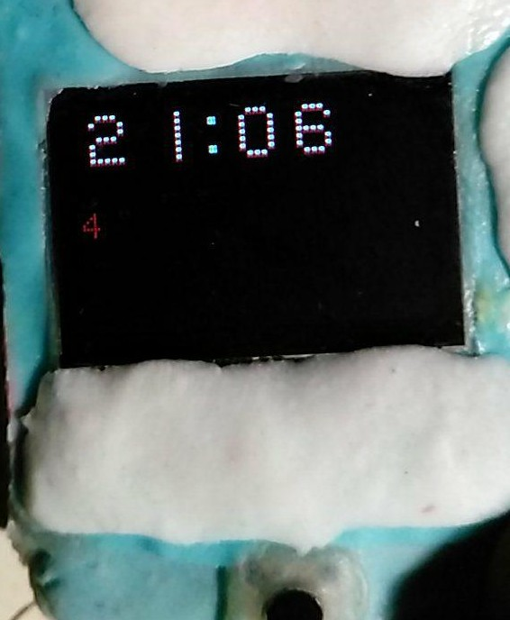
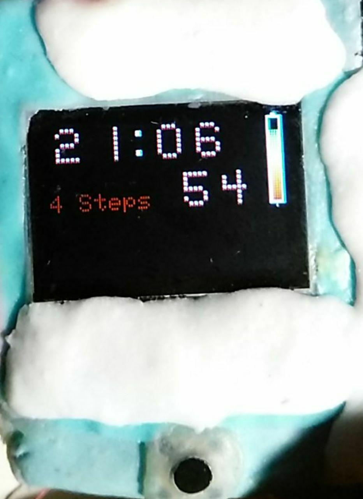
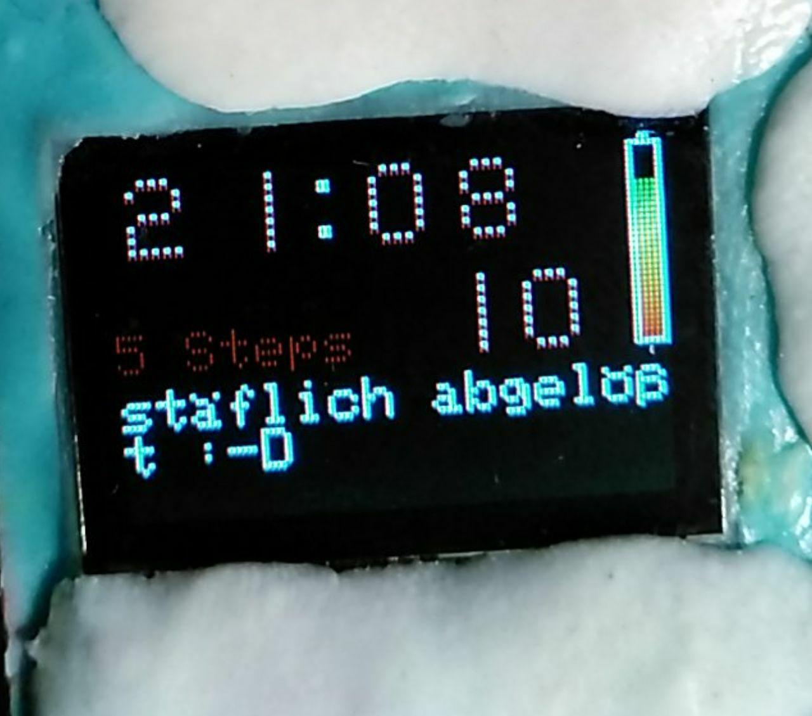
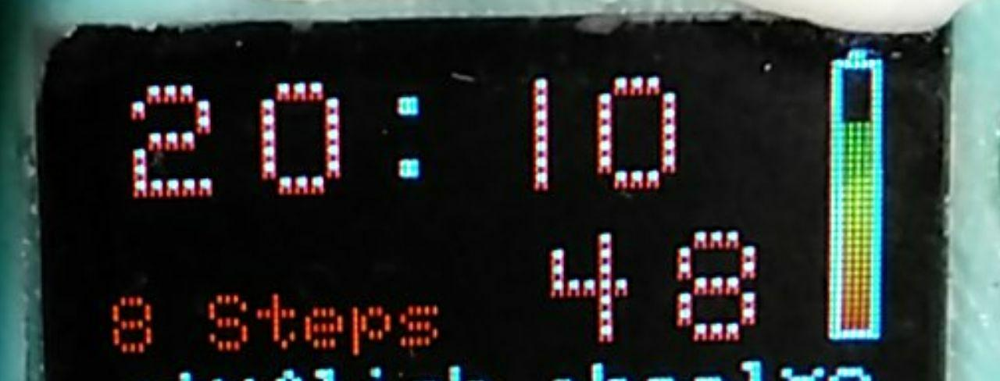
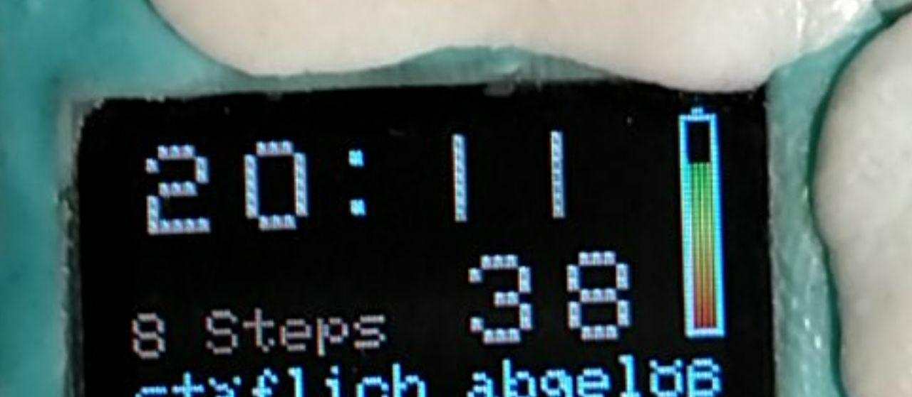

# feather M0 ssd1331 watch

using a adafruit feather M0 with SPI oled SSD1331 (16bit) and MPU-6050 as watch and step counter.

## Hardware and Features

 -  feather M0 with BLE module nRF52 (set clock and send small messages via UART)
 -  OLED 16bit color SPI display (clock, powerbar, with dim mode and off mode)
 -  MPU6050 i2c gyroscope chip (shake to switch display on and steps counting)
 -  small ear speaker (beep on button press)
 -  3 buttons: set hours, minutes, display on and show details (long press)
 -  25k poti to change the clock color
 -  3,7V 180mAh lipo (>10h)

I use the watchdog timer https://github.com/adafruit/Adafruit_SleepyDog to sleep
and NOT `delay()` to save power!

## wackup

shake or press button

## dim display

## display off

it is a black display and save power :-D

## longpress details

## bluetooth UART message

## poti for different color

# bugs

sometimes I got a restart :-S
